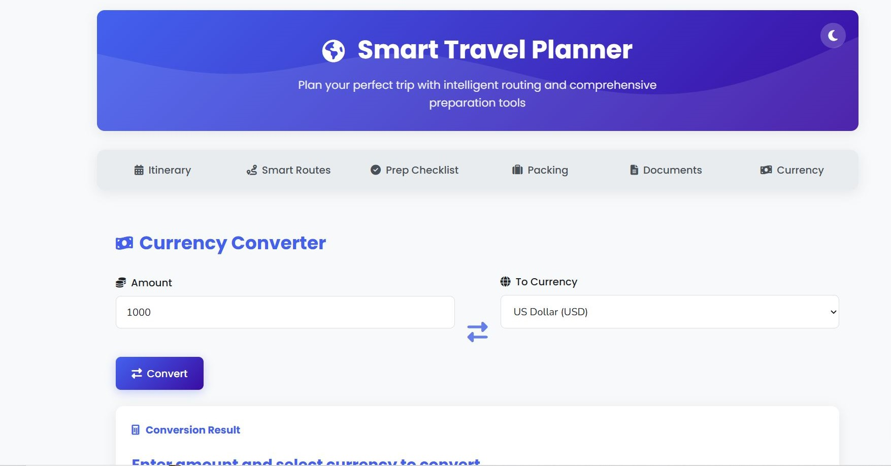

# 🌍 WanderWise

**Smart routes. Hidden gems. Travel smarter.**

WanderWise is your intelligent travel companion — designed to help you plan smarter routes, uncover hidden local treasures, and personalize your adventures. Whether you're a tourist or a traveler, WanderWise ensures you navigate like a local and discover the unseen.

🚀 **Live Demo:**  
[https://balamurugan-cyber.github.io/WanderWise-Smart-routes.-Hidden-gems.-Travel-smarter.-/](https://balamurugan-cyber.github.io/WanderWise-Smart-routes.-Hidden-gems.-Travel-smarter.-/)

---

## 🔠 Tagline Meaning

| Phrase          | Meaning / Emotion                                             |
|-----------------|---------------------------------------------------------------|
| ✅ Smart routes | AI-optimized travel paths, fewer crowds, efficient time use    |
| ✅ Hidden gems  | Local secrets, offbeat attractions, unique food spots          |
| ✅ Travel smarter | Convenience, personalization, and informed choices           |

---

## 📱 Use It For

- App Store tagline  
- Landing page hero section  
- Social media bios or ads  
- Pitch decks & investor slides  

---

## ✨ Variant Options

- **WanderWise – Smarter routes. Local secrets. Personalized adventures.**
- **Navigate like a local. Discover like a traveler.**
- **Your smart travel guide to the unseen.**

---

## 🎯 Features

- 🧭 **Smart Route Planner**: Find the most optimized travel routes.
- 📋 **Trip Itinerary Builder**: Create day-wise plans with estimated budgets.
- 🎒 **Packing Assistant**: Get tailored packing lists based on your trip type.
- ✅ **Pre-Trip Checklist**: Stay organized with categorized task lists.
- 📄 **Document Tracker**: Keep track of important travel documents with expiry reminders.
- 💱 **Currency Converter**: Instantly convert from INR to global currencies.
- ⬆️ **Back to Top Button**: Scrolls to the top smoothly for better UX.
- 🌓 **Theme Toggle**: Switch between light and dark modes for better readability.

---

## 💡 Future Improvements

### 🔧 Potential Enhancements
1. **UI Overhaul**: Improve visual design for better responsiveness and UX.
2. **Authentication System**: Connect to a database for user login/signup functionality.
3. **AI Chatbot Integration**: Implement a travel assistant chatbot for user queries and trip suggestions.

---

## 🛠️ Tech Stack

- **Frontend**: HTML5, CSS3, JavaScript
- **Icons**: Font Awesome
- **Fonts**: Google Fonts (Poppins, Nunito)
- **Responsive Design**: Media queries for mobile-first UI

---

## 🖼️ Screenshots

### 🧭 Travel Planner UI


---

## 🧑‍💻 Installation (Local Development)

```bash
git clone https://github.com/Balamurugan-cyber/WanderWise-Smart-routes.-Hidden-gems.-Travel-smarter.-.git

# Open index.html in your browser
